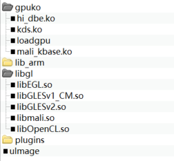
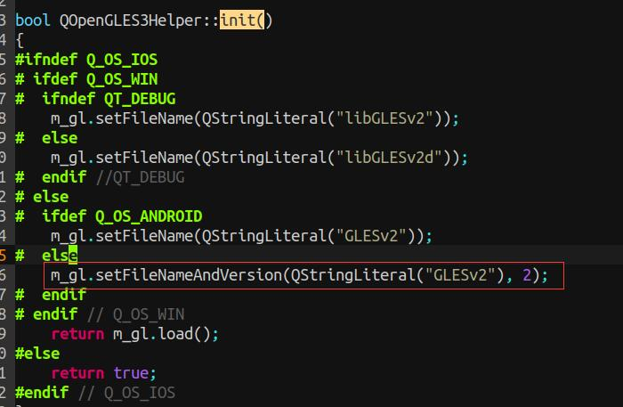

<font face="微软雅黑">

# <center> Hi3536 Qt硬件加速 </center>
&emsp;&emsp;使用 Hi3536 进行项目开发，实际项目中使用 webkit + HTML5 的方式作为程序的 GUI。在高 DPI 下，GUI 页面的刷新速度特别慢。<br>
<br>
&emsp;&emsp;当前移植的 Qt 使用的显示插件是 linuxfb，不支持硬件加速。需要重新交叉编译 Qt，添加 eglfs 插件，使用硬件加速提高页面的显示速度。<br>

***

## 1、Qt交叉编译
&emsp;&emsp;使用 Qt5.5.1 进行交叉编译，源码下载地址：http://download.qt.io/archive/qt/5.5/5.5.1/single/ 。<br>
<br>
&emsp;&emsp;编译 webkit 需要依赖 ICU，按照 qt_toolchain 文件夹中的说明文档进行 ICU 的编译安装。不需要 webkit 可跳过这一步。<br>
<br>
&emsp;&emsp;接下来进入 Qt 源码解压后的路径，进行 Qt 的交叉编译。<br>
### 1.1 mkspecs
&emsp;&emsp;使用 arm-hisiv400-linux-g++ 进行交叉编译，将 ./qtbase/mkspecs 目录下的 linux-arm-gnueabi-g++ 复制为 arm-hisiv400-linux-g++。<br>
``` shell
cp linux-arm-gnueabi-g++ linux-arm-gnueabi-g++ –rf
```
<br>

&emsp;&emsp;修改 ./qtbase/mkspecs/linux-arm-gnueabi-g++ 下的 qmake.config。添加 EGL 相关配置。<br>
``` Makefile
#
# qmake configuration for building with arm-linux-gnueabi-g++
#

MAKEFILE_GENERATOR      = UNIX
CONFIG                 += incremental
QMAKE_INCREMENTAL_STYLE = sublib

include(../common/linux.conf)
include(../common/gcc-base-unix.conf)
include(../common/g++-unix.conf)

# modifications to g++.conf
QMAKE_CC                = arm-hisiv400-linux-gcc
QMAKE_CXX               = arm-hisiv400-linux-g++
QMAKE_LINK              = arm-hisiv400-linux-g++
QMAKE_LINK_SHLIB        = arm-linux-gnueabi-g++

# modifications to linux.conf
QMAKE_AR                = arm-hisiv400-linux-ar cqs
QMAKE_OBJCOPY           = arm-hisiv400-linux-objcopy
QMAKE_NM                = arm-hisiv400-linux-nm -P
QMAKE_STRIP             = arm-hisiv400-linux-strip

#EGL
QMAKE_INCDIR 			+= /opt/hisi-linux/x86-arm/arm-hisiv400-linux/target/usr/include 
QMAKE_LIBDIR			+= /opt/hisi-linux/x86-arm/arm-hisiv400-linux/target/lib/a7_softfp_vfpv4 

QMAKE_INCDIR_EGL		+= /home/horo/work/sdk/Hi3536_SDK_V2.0.6.0/mpp_master/component/gpu/release/include 
QMAKE_LIBDIR_EGL		+= /home/horo/work/sdk/Hi3536_SDK_V2.0.6.0/mpp_master/component/gpu/release/lib 
QMAKE_INCDIR_OPENGL_ES2 += /home/horo/work/sdk/Hi3536_SDK_V2.0.6.0/mpp_master/component/gpu/release/include 
QMAKE_LIBDIR_OPENGL_ES2 += /home/horo/work/sdk/Hi3536_SDK_V2.0.6.0/mpp_master/component/gpu/release/lib 

DEFINES 				+= EGL_FBDEV

QMAKE_LIBS_EGL			= -lEGL -lGLESv2 -lmali
QMAKE_LIBS_OPENGL_ES2	+= $$QMAKE_LIBS_EGL

DISTRO_OPTS 			+= hard-float
QMAKE_CFLAGS			+= -march=armv7-a #-mcpu=
QMAKE_CXXFLAGS 			+= $$QMAKE_CFLAGS

EGLFS_DEVICE_INTEGRATION = eglfs_mali

load(qt_config)
```
<br>
&emsp;&emsp;其中，OpenGL 头文件和动态库路径按照 SDK 路径进行修改。<br>

### 1.2 configure配置
&emsp;&emsp;执行如下配置命令：<br>
```shell
./configure --prefix=/opt/qt5 -opensource \
-confirm-license -no-qml-debug -qt-zlib \
-qt-libpng -qt-libjpeg -qt-freetype -no-harfbuzz \
-no-openssl -no-libproxy -nomake examples -no-nis \S
-no-cups -no-tslib -no-fontconfig -no-pch \
-no-dbus -no-use-gold-linker -no-xcb -opengl es2 -egl \
-eglfs -linuxfb -no-kms -no-directfb -no-c++11\
-icu  -v  -I/usr/local/icu/include  -L/usr/local/icu/lib -Wl,-rpath,/usr/local/icu/lib -ldl \
-xplatform arm-hisiv400-linux-g++ -I/home/horo/work/sdk/Hi3536_SDK_V2.0.6.0/mpp_master/component/gpu/release/include \
-L/home/horo/work/sdk/Hi3536_SDK_V2.0.6.0/mpp_master/component/gpu/release/lib 
```

### 1.3 编译
&emsp;&emsp;执行命令 `make -j4`。<br>

### 1.4 安装
&emsp;&emsp;执行命令 `make install`，将 Qt 安装到指定目录下。安装后的 Qt 包含以下内容：<br>
<center></center>

<br>
&emsp;&emsp;其中有用部分包括：<br>

 - lib：Qt 动态链接库。
 - plugins：插件，包含 linuxfb、eglfs 等。

***

## 2、HI3536配置
&emsp;&emsp;所需文件打包为 qt_eglfs，内容如下：<br>
<center></center>


 - gpuko：GPU 依赖驱动。
 - lib_arm：编译后的 libQt 动态库。
 - libgl：海思提供的 opengl 动态库。
 - plugins：Qt 插件。
 - uImage：系统内核。驱动加载不成功的情况下进行替换，使用配置 hi3536_full_A17_slave_defconfig。

### 2.1 加载GPU依赖驱动
&emsp;&emsp;驱动在 SDK 中的路径：Hi3536_SDK_V2.0.6.0/mpp_master/component/gpu/release/ko。将文件加拷贝入设备中。<br>
<br>
&emsp;&emsp;执行文件夹中的 `./loadgpu -i`，加载三个驱动，检查打印信息是否加载成功。<br>
</center>

<table>
  <tr>
    <th bgcolor=gray style="width: 150px;">文件</th>
    <th bgcolor=gray style="width: 700px;">描述</th>
  </tr>
  <tr>
    <td bgcolor=#eeeeee> kds.ko </td>
    <td bgcolor=#eeeeee> 实现进程中与跨进程内存同步 </td>
  </tr>
  <tr>
    <td bgcolor=#eeeeee> hi_dbe.ko </td>
    <td bgcolor=#eeeeee> 实现进程 buffer 内存分配并 export 给 GPU 使用 </td>
  </tr>
  <tr>
    <td bgcolor=#eeeeee> mali_kbase </td>
    <td bgcolor=#eeeeee> 实现 GPU 内核态控制 </td>
  </tr>
</table>

</center>

### 2.2 用户态库文件
&emsp;&emsp;应用程序使用OpenGL ES 2.0/3.x，需链接`libEGL.so`、`libmali.so`、`libGLESv2.so`三个库文件。将三个库文件拷贝到设备的 `/usr/lib` 目录下。<br>
<br>
&emsp;&emsp;其中，`libGLESv2.so` 需要在 `/usr/lib` 目录下**复制**一个动态库 `libGLESv2.so.2`。因为 Qt5.5.1 源码中有个函数链接的是 `libGLESv2.so.2` 动态库。否则会出现 **Failed to load libGLESv2** 的错误。<br>
<center></center>

### 2.3 Qt移植
&emsp;&emsp;**lib库**<br>
&emsp;&emsp;将编译后的 Qt lib 库拷贝到设备的 `/usr/lib` 目录下，替换原有文件。<br>
<br>
&emsp;&emsp;**plugins**<br>
&emsp;&emsp;将 plugins 插件拷贝到 `/usr/local/qt` 目录下。<br>

***

## 3、程序运行
### 3.1 加载GPU依赖库
&emsp;&emsp;执行脚本 loadgpu，加载相关驱动。<br>
### 3.2 设置环境变量
```bash
export QT_QPA_PLATFORM_PLUGIN_PATH=/usr/local/qt/plugins
export QT_QPA_PLATFORM=eglfs
export QT_QPAFONTDIR=/usr/lib/fonts
export QML2_IMPORT_PATH=/usr/lib/qml
export LD_LIBRARY_PATH=/usr/lib:/lib:$LD_LIBRARY_PATH
export QT_QPA_EGLFS_WIDTH=3840               
export QT_QPA_EGLFS_HEIGHT=2160 
```

&emsp;&emsp;设置环境变量，指定插件目录；指定显示插件为 eglfs；指定动态库路径；使用 eglfs 插件需要设置显示器的像素宽高。
### 3.3 执行程序
&emsp;&emsp;运行 Qt 源码中 OpenGL 相关的 example，例如 qtbase/examples/opengl/hellogl2，可以正常显示窗口。
